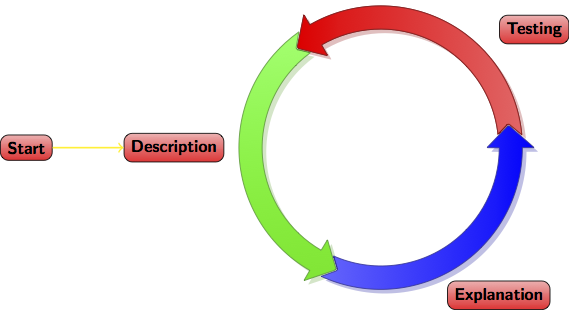

# Introduction

## *Why* this workshop?

- In the *social sciences* few attention to what tools to use (and why they make sense)

- Increasing *need* for/in openness, reproducability & transparancy 

    - from journals, universities and governments
    - increase in cooperation (over wider distances)
    - access to your own files
    - make yourself more visible 

- Why *I* want to give this workshop

    - intrinsic interest
    - my goal: pre-conferences workshops / courses

## What I want (and don't want) with this workshop 

- Give a general introduction of why some tools work together

    - Why version control systems?
    - Why reference managers

- Give an introduction to \LaTeX

    - First the basics
    - Next workshop: some advanced stuff
    
- What *I* do not want

    - Tell you what applications to use (**you** need to decide and make a **well-informed** decision)
    
# Workflow 

## Research cycle

## Why bother about a workflow or tools?

- Good scientific practice: *document how you have achieved your results*; this ensures

    - Reproducibility 
    - Transparency
    - Modularity
    - Portability (across systems and users)
    - Efficiency
    - Self-sanity

## When should I adopt new tools/workflow?

* The sooner the better (you really have time now)
* But think twice about which one (switching is costly; not in terms of beer but in terms of time)
* Start one step at a time (starting with \LaTeX is a pretty neat idea)

*A journey of a thousand miles begins with a single step* 

Lao-tzu

## In general

> In science consensus is irrelevant. What is relevant is reproducible results. The greatest scientists in history are great precisely because they broke with the consensus (Michael Crichton)

## In data science

- Typically, a publication is not at the heart of research

    - Code
    - Data

> The data and code used to make a finding are available and they are sufficient for an independent researcher to recreate the finding (Peng, 2011)

## Code, documentation and output

1. Synonyms

2. All based on `.txt` files 

3. Encompasses almost anything
    - data itself (`.csv`)
    - set of commands for data cleaning and statistical analysis (`.do`, `.R`)
    - database with references (`.bib`)
    - transcript of interviews (`.tex`)
    - text for aticles, presentations or websites (`.tex`, `.html`)
    
4. Only output is displayed/interpreted differently (e.g., in a browser or pdf viewer)

## Tools for workflows in this workshop

- Versioning system (Time-Machine, Dropbox, GitHub)

- Reference manager (Mendeley)

- Markup lanaguages
    - \LaTeX 
    - HTML

# Version Control Systems

## Folder structure of your new project (theses, paper, research)

- Think *a priori* about project set-up

    - Seperate analysis, data and output files

- Be careful with source data!

    - Seperate source and derived data files
    - Typically
        
        - you get/collect data
        - transform data
        - analyse data
    
    - Keep track of all these stages!

## Why is version control systems such a neat idea

## Version control systems

With version control system only one copy of each file (but with fully backed-up history)

A version control system is not the same as a backup devise, but the combination is a killer-ap

- Time machine (mac only) with external hard drive

- Dropbox

- more advanced stuff: Git and GitHub

With `.txt` files you can use the `diff` command

# Reference managers

## Why reference managers?

This is a life saver!

> Use one!

Several applications out there:

    - In this case Mendeley (free but not open source)
    - Make sure it exports to `.bib` files
    - Search for references (google scholar, jstor, etc.)
    - Mendeley can import `.pdf`'s

# \LaTeX

## Background

- \TeX has been devised by Donald E. Knuth in the late 70's
- \LaTeX is a set of macro's around TeX and devised in the 80's
- \LaTeX is a *typesetting program*, not a *Word processor* 

    - It is actually some code that needs to be compiled
    - Code is typed in by an editor

- So, huge differences between

    - Word processor: Open Office, Word
    - Typesetter: \LaTeX, Adobe's InDesign (in general XML)
    - Editors:
        
        - Specific editors: TexStudio, TexShop, RStudio
        - General editors: Sublime, TextMate, Notepad++, Vim, Emacs
        
## Disadvantages

- Not WYSIWYG 
- You nead to learn (quite) some commands

    - Learning curve, but
    - hurray for [cheat sheets](http://www.stdout.org/~winston/latex/latexsheet-a4.pdf) and Google
    
- Very specific lay-outs difficult to attain
- Basic \LaTeX has *difficulties* with incorporating new fonts (Hoefler, minion pro)

    - XeTeX 
    - For the purists: \LaTeX does it right [(\LaTeX vs Word)](http://oestrem.com/thingstwice/2007/05/latex-vs-word-vs-writer/)
    
## Advantages

- Free (as in beer) and ubiquitous
- WYSIWYM
- Consistent lay-out throughout the whole document (including tables, appendices, formulas, source code, etc)
- Internal references are a breeze (references, tables of, indices)
- Forced to structure documents
- Macros, thus scriptable
- Large community, thus a package for almost everything (books, articles, presentation, posters, exams, musicscores)
- Superior typography & output
- Large publishers (i.e., Elsevier and Springer) have \LaTeX templates for their articles

## How does it work in practice?

- You edit a `.tex` file without thinking about how it looks
    
    - distraction free writing (yeah right)
    
- You then compile it

    - \LaTeX is unforgiving: if there is an error, usually it does not compile
    - Typically, errors are missing brackets or parentheses. 
    
- Typically, source `.tex` file is compiled into `.pdf`
